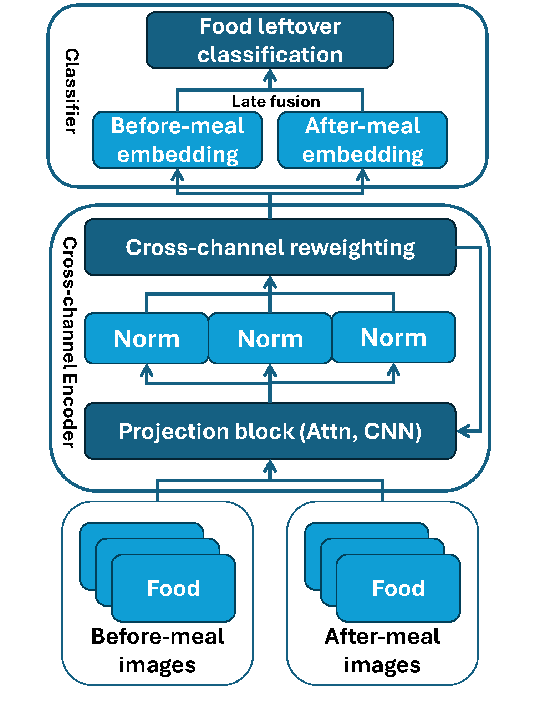
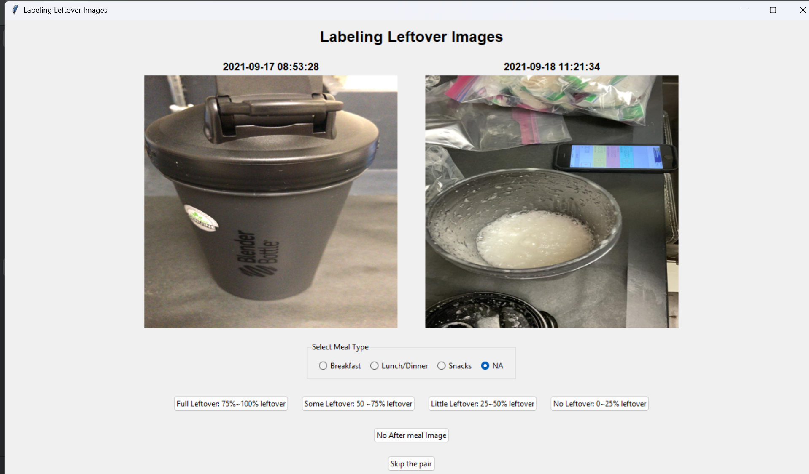

_Manuscript Under review by EMBC 2025._

# Food-Leftover-Detection
This is the code implementation for our EMBC 2025 submission: Efficient Cross-Channel Feature Selection for Food Leftover Detection

Corresponding Author: [Sicong Huang](https://stmilab.github.io/team/).

## Description

FoodRemainder offers the potential for free-living food leftover estimation, paving the way for improving automated dietary monitoring solutions, particularly for individuals at risk of obesity and type 2 diabetes (T2D).

## Prerequisites

### Setup Environment
Our experiments are conducted on a Linux-based machine with the following specifications:

* Linux-based OS 
* Python 3.9.15
* conda 4.14.0
* PyTorch 1.11.0
* git 2.34.1
* CUDA 12.0 (for GPU acceleration)

We highly recommend you to use the conda environment ([`environment.yml`](environment.yml)) we shared to avoid potential compatibility issues. To set up Conda for your computer, you can follow the official [instruction](https://conda.io/projects/conda/en/latest/user-guide/install/index.html).

Instructions for Unix-based Command Line Input: 

1. `git pull https://github.com/stmilab/Food-Leftover-Detection.git` clones the repository to your local machine

2. `cd Food-Leftover-Detection/` changes the directory to the repository

3. `conda env create -f environment.yml` creates a new conda environment the same as ours ([`environment.yml`](environment.yml) contains the packages used for our experiments.)

4. `conda activate foodremainder` activates the created conda environment you just created

## Implementations
FoodRemainder contains 3 major components:
* [GUI for label annotation](#gui-for-label-annotation)
* [Dinov2 for channel extraction](#dinov2-for-channel-extraction)
* [Model for food leftover detection](#model-for-food-leftover-detection)

### GUI for Label Annotation

* The [`step1_annotate_img/`](step1_annotate_img/) directory contains the scripts and GUI to annotate the food leftover images
* The [`step1_annotate_img/annotate_label.py`](step1_annotate_img/annotate_label.py) file call the GUI to start annotating
    * Please modify `image_directory` according to your dataset location
    * Specify the filename of your output by modifying `json_path`

### Dinov2 for Channel Extraction

* The [`step2_extract_channel/`](step2_extract_channel/) directory contains the scripts to convert original images into semantic segmentations and monocular depth images. 
* The [`step2_extract_channel/dinov2/`](step2_extract_channel/dinov2/) is modified from the original [DINOv2](https://github.com/facebookresearch/dinov2) repository.
    * The [`depth_estimation.py`](step2_extract_channel/depth_estimation.py) file converts the original images into monocular depth images
    * The [`segmentation.py`](step2_extract_channel/segmentation.py) file converts the original images into semantic segmentation images

### Model for Food Leftover Detection

* The [`step3_predict_leftover/`](step3_predict_leftover/) directory contains the main scripts for all experiments conducted and reported in the manuscript
* The [`step3_predict_leftover/utils/`](step3_predict_leftover/models/) directory contains the utility functions used by the main scripts
    * The [`parser.py`](step3_predict_leftover/utils/parser.py) file contains the argument parser for the main scripts
    * The [`data_loader.py`](step3_predict_leftover/utils/data_loader.py) file extracts the images and constructs Pytorch datasets and associated dataloaders
    * The [`helper.py`](step3_predict_leftover/utils/helper.py) file contains the evaluation metrics for the main scripts
* The [`step3_predict_leftover/models/`](step3_predict_leftover/models/) contains the custom functions used in the experiments.
    * The [feature selector](step3_predict_leftover/models/exchange.py) mechanism is based on [CEN](https://github.com/yikaiw/CEN/tree/master) implementation
* [`step3_predict_leftover/exp_detail/`](step3_predict_leftover/exp_detail/) contains the detailed configurations of hyperparameters used by all experiments conducted and reported in the manuscript
    * Hyperparameter tuning is conducted using [Weights & Bias](https://wandb.ai/) with the following scope: [`hyperparam.txt`](exp_setup/mimic_hyperparam.txt)

## Datasets

### CGMacros Dataset

We used the CGMacros dataset (version 1.0.0). 
* The dataset is publicly available on [PhysioNet](https://physionet.org/content/cgmacros/1.0.0/)

* Remember to modify `--data_path` according to your dataset location, otherwise change the default value in [`parser.py`](step3_predict_leftover/utils/parser.py)
